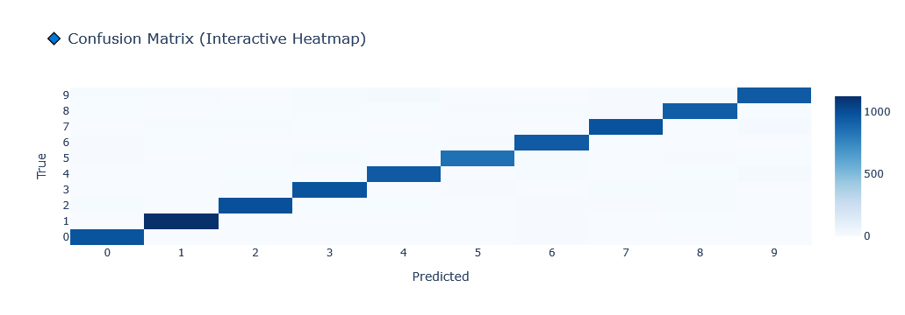
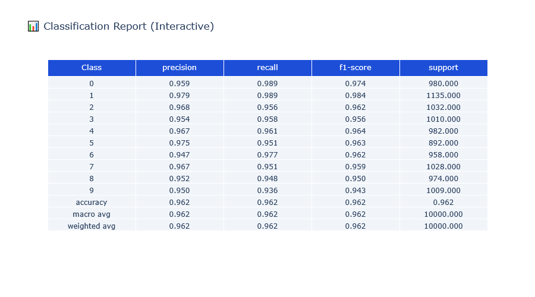

# MNIST Classification using MLP (TensorLayer) 🔢

A fundamental implementation of a Multi-Layer Perceptron using the `TensorLayer` library.

## Overview
* **Input:** Flattened 28x28 grayscale images.
* **Architecture:** Fully Connected layers with ReLU activation.
* **Goal:** Establish a baseline performance for digit classification before moving to more complex architectures like CNNs.
* ## 📊 Visualization Results

### Confusion Matrix

### Performance Metrics
